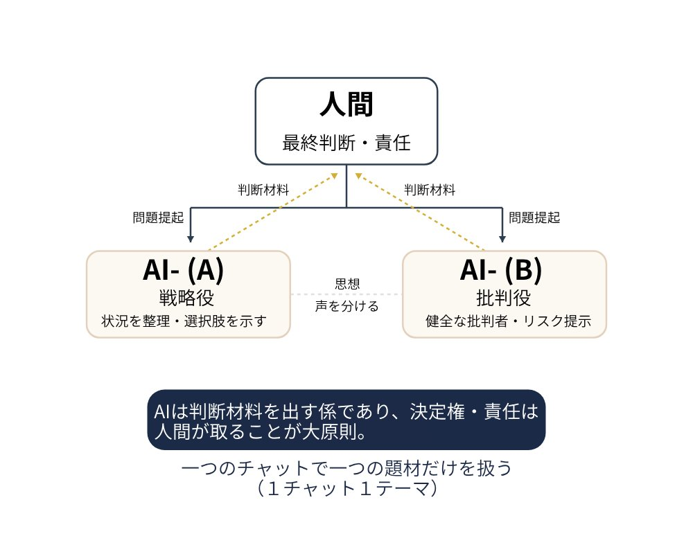

# クロコ式

**クロコ式**は、ひとりの人間とふたつのAIが「会議」をして意思決定する方法論です。
人間が最終判断を下し、AIの一方が「健全な批判者」として、都合の悪いことも含めて遠慮なく指摘します。

> AIを“イエスマン”にしない。
> リスクも反対意見も建設的に出し合い、最後は人間が決める。

---

## なぜ公開するのか

AIは便利です。でも使い方を間違えると、「持ち主に都合のいいことしか言わない道具」になります。
それでは、大事な意思決定をかえって誤らせてしまう。

クロコ式は、私たちが日々の経営判断で実際に使っている「AIとの付き合い方」です。
これを無償で公開することで、日本の誰かの意思決定が少しでも良くなればと願っています。

難しい理論はいりません。今日から、誰でも試せます。

---

## クイックスタート（今日から試す）

1. **問いを立てる**（あなた＝判断役）
   決めたいこと・相談したいことを1つ用意する。
2. **戦略役のAIに相談する**
   状況を整理し、選択肢と論点を出してもらう。
3. **批判役のAIに「健全な批判者」を頼む**
   「イエスマンにならず、リスク・デメリット・反対意見を必ず出して」と指示する。
4. **あなたが最終判断する**
   AIは材料を出す係。決めて、責任を持つのはあなた。

> AIは1つでも回せます。「いったん賛成側、次に批判側」と役を切り替えるだけでも効果があります。

---

## 三者会議の形



- **大原則**：AI は判断材料を出す係であり、決定権・責任は人間が取る
- **1チャット1テーマ**：ひとつの会議では、ひとつの題材だけを扱う

---

## ドキュメント

| ファイル | 内容 |
|---|---|
| [METHOD.md](METHOD.md) | 三者会議のやり方（役割・進め方） |
| [PRINCIPLES.md](PRINCIPLES.md) | 人間最終判断・健全な批判者などの原則 |
| [GLOSSARY.md](GLOSSARY.md) | 用語集 |
| [TRADEMARK.md](TRADEMARK.md) | 商標と使い方のルール |
| [LICENSE](LICENSE) | ライセンス（CC BY 4.0） |

---

## 引用 (Citation)

本リポジトリは **Software Heritage** に永久アーカイブされ、**SWHID（永続識別子）** が発行されています。学術論文や公的文書で引用される際は、以下をご利用ください。

**SWHID:**

```
swh:1:dir:d292d5aead2448877f2b6965ed5e5c61822e8e3b
```

**BibTeX:**

```bibtex
@software{kurokoshiki_2026,
  author    = {Teshigawara, Yu},
  title     = {{Kuroko-shiki: Three-Party AI Decision Method}},
  year      = {2026},
  publisher = {Imperial Messenger Co., Ltd.},
  url       = {https://github.com/imperial-messenger/kuroko-shiki},
  note      = {swh:1:dir:d292d5aead2448877f2b6965ed5e5c61822e8e3b},
}
```

**先取権 (prior art) の4重証明:**

| 層 | 内容 |
|---|---|
| GitHub | 公開リポジトリのコミット履歴 |
| Software Heritage | 国際公的アーカイブ + SWHID（INRIA / UNESCO） |
| OpenTimestamps | 暗号学的時刻証明（`SHA256SUMS.ots`） |
| Bitcoin Blockchain | Block #951844 / #951846 への二重アンカー |

---

## ライセンスと名称について

- この方法論は **CC BY 4.0** のもとで、誰でも自由に使えます（出典表示をお願いします）。
- 「クロコ式」は株式会社インペリアル・メッセンジャーが商標として2026年5月29日に出願済みです（商願2026-061725、™）。
  方法論の実践は自由ですが、サービスや商品の名前として「クロコ式」を名乗るには許諾が必要です。
  詳しくは [TRADEMARK.md](TRADEMARK.md) を参照してください。

---

*クロコ式は、株式会社インペリアル・メッセンジャーと、ひとりの経営者（テッシー）＋ふたつのAI（CAちゃん・クロコ）の実践から生まれました。*
